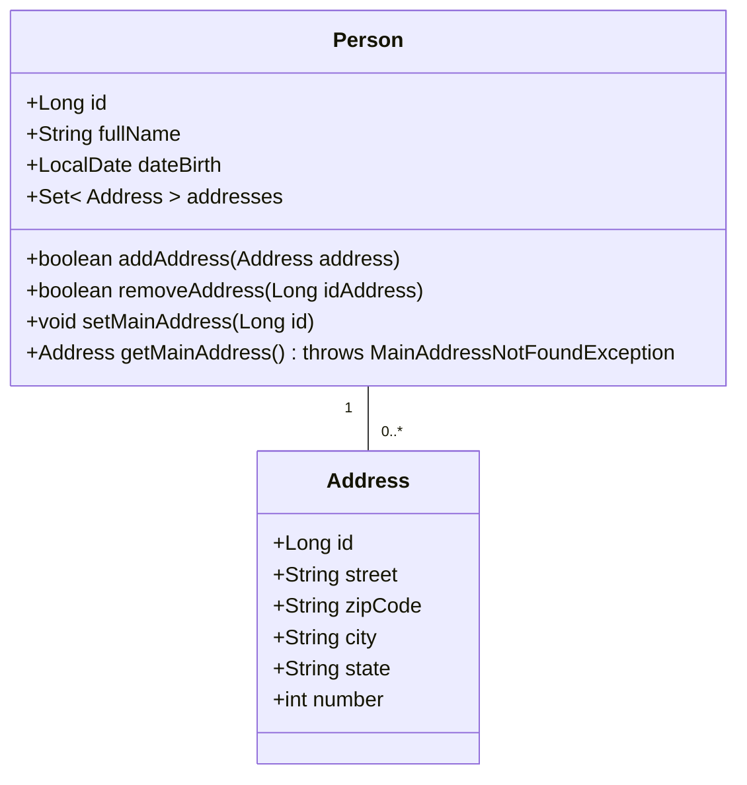

# Sistema de gerenciamento de pessoas e/com endereços

## Tecnologias Utilizadas

### Linguagens de Programação
- Java

### Frameworks e Bibliotecas
- Spring Boot: Framework utilizado para facilitar a configuração e o desenvolvimento de aplicativos Spring.
- Spring Data JPA: Biblioteca que simplifica o acesso e a manipulação de dados em bancos de dados relacionais.
- Spring Validation: Biblioteca utilizada para validação de entrada de dados.
- Spring Web: Biblioteca para o desenvolvimento de aplicativos da web com Spring MVC.
- Springdoc OpenAPI: Biblioteca para geração de documentação OpenAPI (anteriormente conhecida como Swagger) para APIs Spring.
- H2 Database: Banco de dados em memória.
- Lombok: Biblioteca para reduzir o boilerplate do código Java.

### Ferramentas de Desenvolvimento
- Maven: Ferramenta de automação de compilação e gerenciamento de dependências.

## Contributing

We welcome and appreciate your contributions to this project! Whether you have suggestions, bug fixes, or new features you'd like to add, please feel free to fork this repository.

### How to Contribute

1. Fork the project.
2. Create a branch for your contribution: `git checkout -b my-contribution`.
3. Make your changes and commit: `git commit -m 'Add my contribution'`.
4. Push to your branch: `git push origin my-contribution`.
5. Open a pull request for review.

## Feedback and Issues

If you have contributions, suggestions, or feedback, feel free to open an issue.
